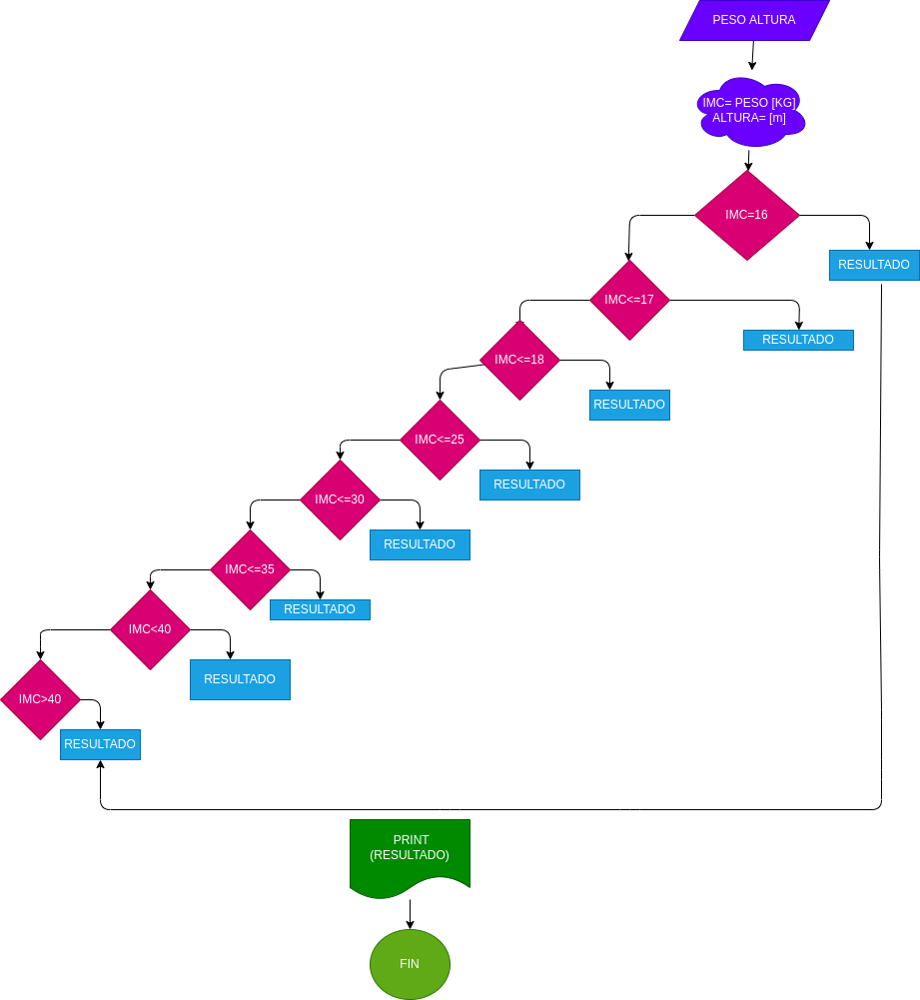

# MASA CORPORAL 

programa para saber su masa corporal  de acuerdo a su peso y altura 

# Analisis

variables de entrada (input)

PESO = Su peso ingresado

ALTURA = su altura ingreasada

Variables de proceso (processing) 

RESULTADOS = Son los resultaddos de su indice dde peso

variables de salida (output)

IMC Y RESULTADOS = Resultados de su indice de peso y el resultado de estos

# diseño

# CONSTRUCCION 
