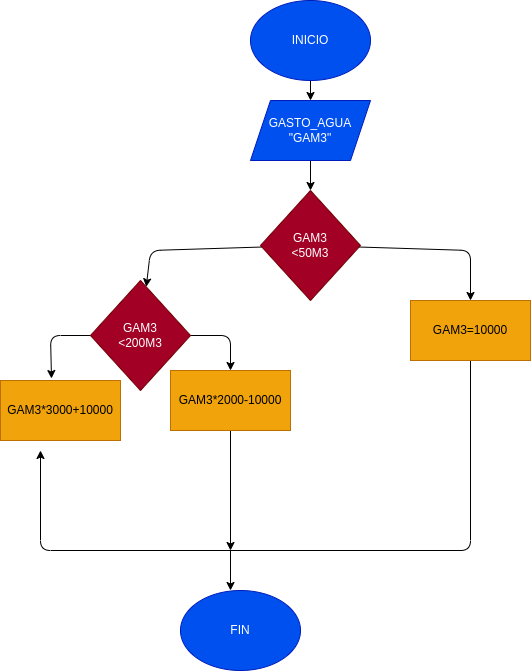

# instrucionescondicionales

# Precio a pagar por gasto de agua
Programa para saber el precio adecuado a pagar

# ANALISIS

Variables de entrada

Gasto_agua

variables de proceso

Pago = Es el monto a pagar dependiendo del consumo de agua de la vivienda

Variables de salida

Pago: Es el monto requerido por la empresa a pagar

# DISEÑO

#  CONSTRUCCION
